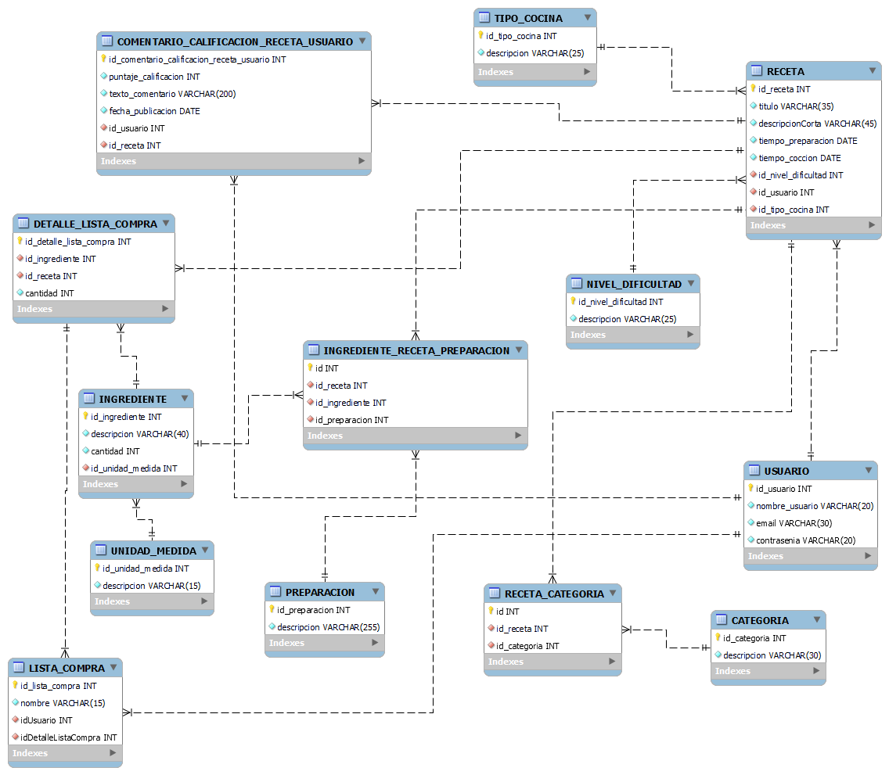

# Ejercicio Práctico CRUD con Express + Sequelize

## Objetivo: 

* Se debe realizar la estructura del backend para el siguiente caso. El mismo debe contener todos los modelos y las rutas CRUD de al menos 1 (UN) modelo.

Puedes apoyarte en la realización de un DER básico. Plataforma de Recetas de Cocina "Sabor Compartido" 

Se desea crear un sitio web donde los usuarios puedan compartir, buscar y calificar recetas de cocina. 

Plataforma de Recetas de Cocina "Sabor Compartido" Se desea crear un sitio web donde los usuarios puedan compartir, buscar y calificar recetas de cocina. Los Usuarios se registran con un nombre de usuario (único), email y contraseña. Pueden subir sus propias Recetas. Cada receta tiene un ID único, un título, una descripción corta, el tiempo estimado de preparación, el tiempo de cocción, el nivel de dificultad (fácil, medio, difícil) y es creada por un único usuario. Las recetas pertenecen a una o más Categorías (ej: 'Postres', 'Platos Principales', 'Vegetariano', 'Sin Gluten'). También se pueden clasificar por tipo de Cocina (ej: 'Italiana', 'Mexicana', 'Asiática'). Cada receta se compone de una lista de Ingredientes necesarios y una secuencia de Pasos de Preparación. Para cada ingrediente en una receta, se debe especificar la cantidad (ej: '200') y la unidad de medida (ej: 'gramos', 'tazas', 'unidades'). Un mismo ingrediente (ej: 'Harina de trigo') puede usarse en muchas recetas. Los pasos de preparación deben estar numerados para indicar el orden correcto y contener el texto de la instrucción. Los usuarios pueden valorar las recetas que han probado mediante una Calificación, asignando un puntaje (ej: de 1 a 5 estrellas). También pueden dejar Comentarios escritos en las recetas, expresando su opinión o haciendo preguntas. Tanto las calificaciones como los comentarios están asociados al usuario que los emite y a la receta correspondiente, y tienen una fecha de publicación. Además, los usuarios pueden crear Listas de Compras personalizadas. Una lista de compras tiene un nombre (ej: "Compra semanal", "Ingredientes Torta") y pertenece a un usuario. El usuario puede agregar ingredientes a su lista, especificando la cantidad y unidad que necesita comprar. Estos ingredientes pueden provenir de una o varias recetas o ser añadidos

## Identificación de los modelos y sus atributos

### Usuarios:  
> Los Usuarios se registran:
* Nombre de usuario (único) 
* email
* contraseña. 
* Lo usuarios pueden subir sus propias Recetas. 

### Receta:  
> Cada receta tiene:
* ID único, 
* título, 
* descripción corta, 
* tiempo estimado de preparación, 
* tiempo de cocción, 
* nivel de dificultad
* Es creada por un único usuario. 
* Las recetas pertenecen a una o más Categorías (ej: 'Postres', 'Platos Principales', 'Vegetariano', 'Sin Gluten'). 
* También se pueden clasificar por tipo de Cocina (ej: 'Italiana', 'Mexicana', 'Asiática'). 
* Cada receta se compone de una lista de Ingredientes necesarios y una secuencia de Pasos de Preparación. 

### Categoria:
* id
* descripcion

### Nivel de dificultad
* id
* descripcion (fácil, medio, difícil) 
* La receta conoce a el nivel de dificultad

### Receta - Categorias:
* id
* id de la receta
* id de la categoria

### Tipo de cocina:
* id
* descripcion (ej: 'Italiana', 'Mexicana', 'Asiática').
* Esta asociado a la receta

### Ingredientes:  
> Para cada ingrediente en una receta, se debe especificar:
* id
* descripcion
* Cantidad (ej: '200')
* Unidad de medida (ej: 'gramos', 'tazas', 'unidades'). 
* Un mismo ingrediente (ej: 'Harina de trigo') puede usarse en muchas recetas. 

### Unidad Medida
> Unidad de medida (ej: 'gramos', 'tazas', 'unidades')
* id
* descripcion 

### Ingredientes - Receta - Preparacion:
* Id
* Id de la receta
* Id de ingredientes
* Id de preparacion

### Preparación:
> Los pasos de preparación:
* IdPreparacion: Deben estar numerados para indicar el orden correcto
* Descripcion: Deben contener el texto de la instrucción. 

### ComentarioCalificacionRecetaUsuario:
> Los usuarios pueden valorar las recetas que han probado mediante una Calificación: 
* Asignando un puntaje (ej: de 1 a 5 estrellas). 
* Esta asociado al usuario que emite

> También pueden dejar Comentarios escritos en las recetas, expresando su opinión o haciendo preguntas. Tanto las calificaciones como los comentarios están asociados al usuario que los emite y a la receta correspondiente, y tienen una fecha de publicación.
* id
* texto correspondiente al comentario
* fecha de publicacion
* Esta asociado al usuario que emite

### Lista de Compras
> Además, los usuarios pueden crear Listas de Compras personalizadas. Una lista de compras tiene un nombre (ej: "Compra semanal", "Ingredientes Torta") y pertenece a un usuario. El usuario puede agregar ingredientes a su lista, especificando la cantidad y unidad que necesita comprar. Estos ingredientes pueden provenir de una o varias recetas o ser añadidos
* idListaCompra
* nombre
* idUsuario
* idDetalleListaCompra

### Detalle Lista de Compras

* idDetalleListaCompra
* idIngrediente
* idReceta
* cantidad
  
  
  
  
## Diagrama de bases de datos

